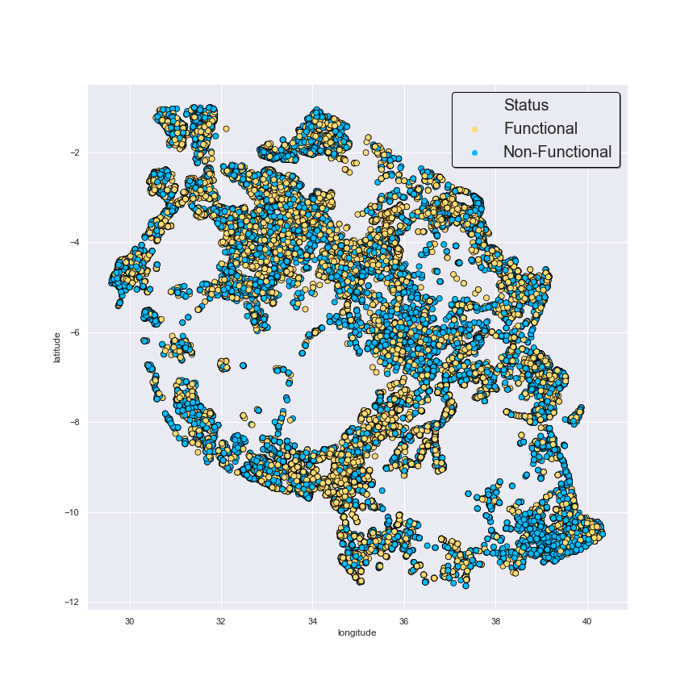
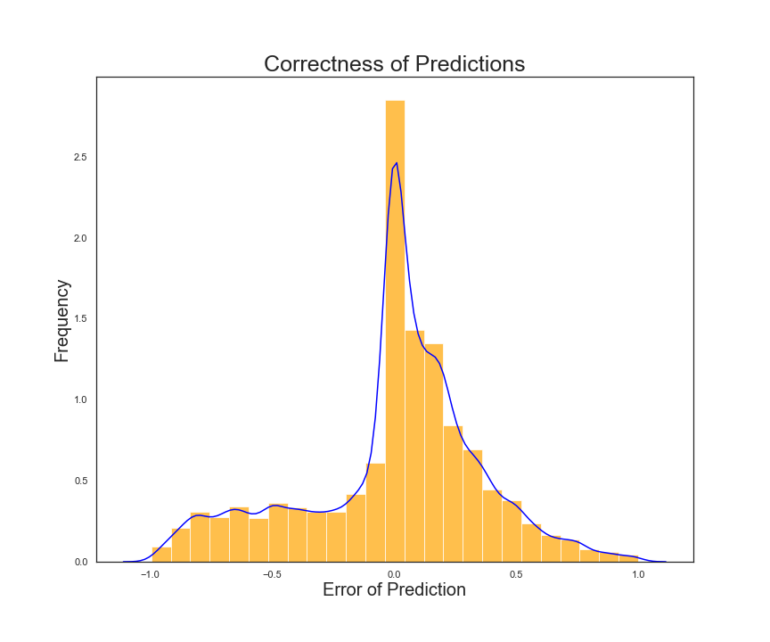
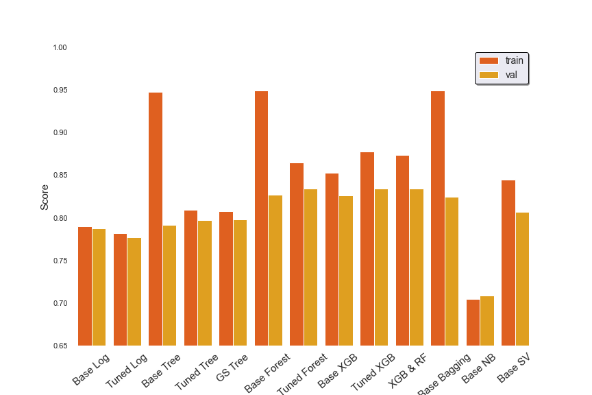
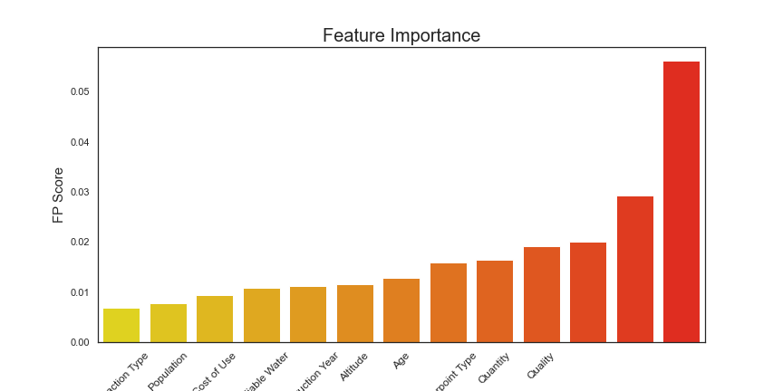
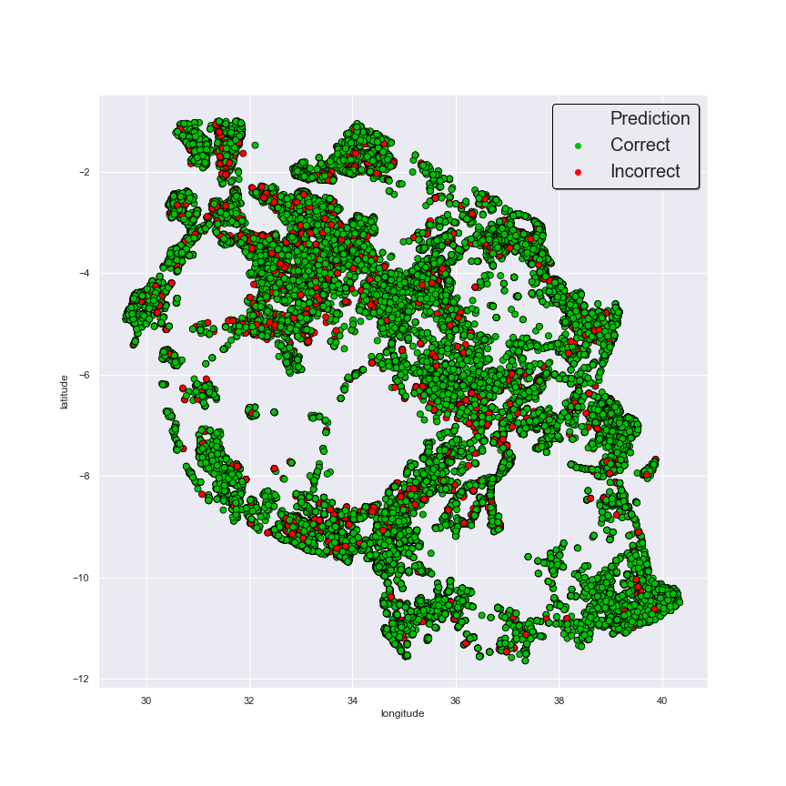

# TanzaniaWaterProject
## Overview: 
In this project, We were tasked by the Tanzanian government to create a predictive model in order to indicate whether wells were functional or non-functional across the nation. This project was sourced from a Driven Data competition titled Pump it Up: Data Mining the Water Table. Here we were able to hone our skills in feature engineering and model tuning to create the best model. In our repository we have our technical notebook, our exploratory branches containing the work of the two authors, our powerpoint presentation, and we also have our data folder which contains all of the data imported from the competition.

## Data:
The data we used, from the competition was sourced from Taarifa and The Tanzania Ministry of Water. The amount of features included was substantial, with 41 features for each well, not including the functionality of the well (described in the status group feature). These features described the locations of the wells, through both latitude/ longitude/ altitude and the names of the regions/ villages in which the well was located. Also included was information about the source of the water, quality/quantity, well type, and more. Originally, There were three different status options for each well: Functional, non Functional, and Functional needs repair. For the sake of our project we divided it into functional vs. in need of repair.

## Data Cleaning:
We reduced the number of features down to 18, eliminating many of the redundant features that described the same thing but to a different specificity, such as only keeping one of extraction class, group and type. Then we filled in missing values, using the median values for some and replacing the gps_height (well altitude) with information we found about the altitude of the regions the missing wells were from. Then we performed a train test split, One hot encoding the categorical values, applying a standard scaler to the numerical values, and concatenating them back together to have 91 total features/columns for our base model.
## Modeling:
After cleaning our data we went through the process of modeling. We looked at the models’ performances based on accuracy and f1 score, putting more emphasis on f1 score. We ran  base and tuned logarithmic regressions, base and tuned decision tree, a grid search decision tree, a base and tuned random forest, base and tuned XGboost, a stacked random forest XGboost, bagging, naive bayes and a support vector machine. After this exhausting process we found that our tuned Random Forest and XGboost models performed the best, choosing XGboost over Random forest due to its more normalized error. We then attempted to go back and engineer features in order to improve the effectiveness of our best XGboost model: adding and removing similar features, looking at feature importance, and smoting values. We found that removing construction year yielded the best model.

## Conclusion: 
After completing this project, we felt we were able to make a model that successfully addressed the problem at hand. The most challenging and time consuming part of our model was feature engineering, which took us over two days to do, not always yielding beneficial results. We think a large portion of the error in our model comes from having to replace many missing values in columns and that if the data were more complete or if we came up with a better solution to this we would do better. If we were to continue this into the future,  we would like to seee if the socioeconomic status of the region plays a large part in the status of the well as well as possible climate data. We would also possibly like to experiment with more ambitious model stacking.

Thank you for taking the time to read this and examine our code, we wish you the best!
Bobby and Killian
